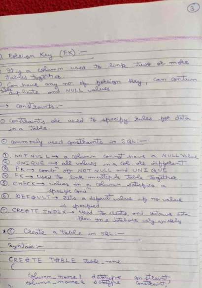

# OpenCV Document Scanner in C++

This project implements a document scanner using OpenCV in C++. The scanner processes an image to detect and warp a document, providing a top-down view of the document. This can be particularly useful for creating digitized versions of paper documents.


## Features

The document scanner performs several key steps:

1. Preprocessing: Converts the image to grayscale, applies Gaussian blur, and performs Canny edge detection to identify edges.
2. Contour Detection: Finds contours in the image and identifies the largest quadrilateral contour, assumed to be the document.
3. Perspective Transformation: Warps the image to obtain a top-down view of the detected document.
4. Image Cropping: Crops the warped image to remove any black borders, providing a clean digitized document image.

# Setup
## Prerequisites

1. OpenCV 4.x or higher installed
2. C++11 or higher compiler (e.g., g++, clang++)
## Installation and Build
1. Install OpenCV
2. Clone the Repository: 

``` sh 
git clone https://github.com/yourusername/OpenCV-DocumentScanner.git
cd OpenCV-DocumentScanner
```
3. Build the Project: 
``` sh 
mkdir build
cd build
cmake ..
make
```

# Code Explanation
## PreProcessing PreProcessing Function
The 'preProcessing' function prepares the image for contour detection by converting it to grayscale, applying Gaussian blur, and detecting edges using Canny edge detection.

## getContours Function
The 'getContours' function identifies the largest quadrilateral contour in the image, assumed to be the document.

## Result Images Explanation:
The output of the document scanner includes:

1. Original Image: The input image before any processing.

2. Threshold Image: Image after preprocessing steps like Gaussian blur and Canny edge detection.

3. Warped Image: Top-down view of the detected document after perspective transformation.

5. Cropped Image: Final result after cropping the warped image to remove excess borders.


